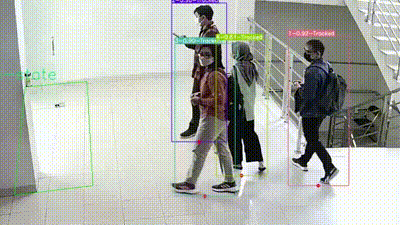

<!-- This content will not appear in the rendered Markdown -->
<a name="readme-top"></a>


# Entry-Exit Monitoring System
<p align="justify">
    Entry-Exit Monitoring System is a part of intelligent surveillance systems. This issue aims to monitor a person’s activity using wide-ranging surveillance cameras in both public and private spaces, such as restrooms, changing rooms, and baby care areas. This study presents the development and evaluation of a single-camera entry-exit monitoring system equipped with person re-identification to maintain a consistent identity while the persons going in and out of an area. The system employs a comprehensive pipeline, including YOLOv7 (original and tiny versions), ByteTrack, and OSNet-x1 as the person detector, tracker, and re-identifier.
    The entry-exit event detection component using the YOLOv7+ByteTrack achieved the highest accuracy, scoring 1 for both entry and exit event detection. Conversely, when using YOLOv7-tiny+ByteTrack, the system showed slightly lower performance with the entry event detection score of 0.975. The best person re-identification performance was observed with YOLOv7+ByteTrack+OSNet-x1, achieving an f1-score of 0.864 and accuracy of 0.826, whereas YOLOv7-tiny+ByteTrack+OSNet-x1 exhibited reduced values of 0.826 and 0.780, respectively. Evaluation of FPS on Google Colab and Nvidia Jetson Xavier AGX revealed peak averages of 26.7 FPS and 13 FPS when using YOLOv7-tiny and 21.8 FPS and 10.6 FPS when using YOLOv7, respectively.
</p>

# System Design

<picture>
  <source media="(prefers-color-scheme: dark)"> 
  
</picture>

<p align="justify">
  The system design can be seen in the picture above. The system consists of three subsystems, person detection, person tracking, and person re-identification. Each subsystem uses various models such as YOLOv7 (original and tiny), ByteTrack, and OSNet-x1. Person detection and person tracking are used to detect, track, and provide an initial ID to individuals in the frame. Meanwhile, the person re-identification subsystem is used to store descriptive information from individuals and recognize the same person when they enter or leave the area monitored by surveillance cameras. The model performance in the person detection and person re-identification subsystems is evaluated through the best hyperparameter tuning, while in the person tracking task, no training process is carried out because it uses a model-free tracking to reduce computational cost. For the Entry-Exit Re-ID system algorithm, the track results from the tracker will be the input for the system. The system will extract the centroid points (state determinator) and features of each track. Then, the tracklet attributes will be iteratively updated and each attribute will be assigned a corresponding ID based on feature matching (cosine similarity). The updated track will be returned from the system that consists valid ID.
</p>

## entry-exit area configuration
<picture>
  <source media="(prefers-color-scheme: dark)"> 
  
</picture>

## result sample
All results and models can be seen in [Results](https://bit.ly/Entry_Exit_ReID_Results)
<picture>
  <source media="(prefers-color-scheme: dark)"> 
  
</picture>

# Getting Started

## Prerequisites
You can see the requuirments in "requirements.txt"

Recommended to use python>=3.7, especially for deployment.
## Installation
You can see .ipynb file
On GoogleColab, we use miniconda for the environment.
```
! wget https://repo.anaconda.com/miniconda/Miniconda3-py37_22.11.1-1-Linux-x86_64.sh
! chmod +x ./Miniconda3-py37_22.11.1-1-Linux-x86_64.sh
! bash ./Miniconda3-py37_22.11.1-1-Linux-x86_64.sh -b -f -p /usr/local
import sys
sys.path.append('/usr/local/lib/python3.7/site-packages/')
```
```
!conda create -n EER python=3.7 -y

%%shell
eval "$(conda shell.bash hook)" # copy conda command to shell
conda activate EER
conda info --env
```

```
!conda install pytorch==1.8.1 torchvision=0.9.1 cudatoolkit=10.2 -c pytorch -y
```
```
!pip3 install -r "/content/drive/MyDrive/Colab Notebooks/EER/Entry_Exit_REID/requirements.txt"

!pip3 install Cython
!pip3 install cython_bbox

%cd "deep-person-reid"
!python setup.py develop
%cd ..
```
## Running
An example running the system on loc1_1 video with YOLOv7+OSnet model
```
python3 "tools/demo.py" \
--name "testing" \
--yolo_weight "models/yolo_15k_300_rep.pt" \
--reid_model_weight "models/rf_120.pth.tar-120" \
--img-size 640 \
--conf-thres 0.65 \
--agnostic-nms \
--feature_match_thresh 0.2 \
--match_count_thresh 3 \
--source "testing_datas/loc1_1.mp4" \
--entry_area_config "testing_datas/loc1_1.json" \
# --without_EER
```

# Deployment

- put docker file outside of the "entry_exit_reid" folder
- go to the directory that contains "DockerFile"
```
sudo docker build .
```

- after image has been build, check the image ID with command below
```
sudo docker images
```

- run the docker image, enjoy the environment
```
sudo docker run -it --runtime nvidia --network host <image ID>
```


# Samples
These two pictures below are the result samples of the system that running with YOLOv7+ByteTrack+OSNet-x1
## True Positive and True Negative Samples
<picture>
  <source media="(prefers-color-scheme: dark)"> 
  
</picture>

## False Positive and False Negative Samples

<picture>
  <source media="(prefers-color-scheme: dark)"> 
  
</picture>

# Acknowledgement
This work has been supported by DIKE lab, FMIPA (Faculty of Natural Science and Mathematics), Gadjah Mada University.

Main references:
- https://github.com/WongKinYiu/yolov7
- https://github.com/ifzhang/ByteTrack
- https://github.com/KaiyangZhou/deep-person-reid


# Citations
Have not been published

<p align="right">(<a href="#readme-top">back to top</a>)</p>